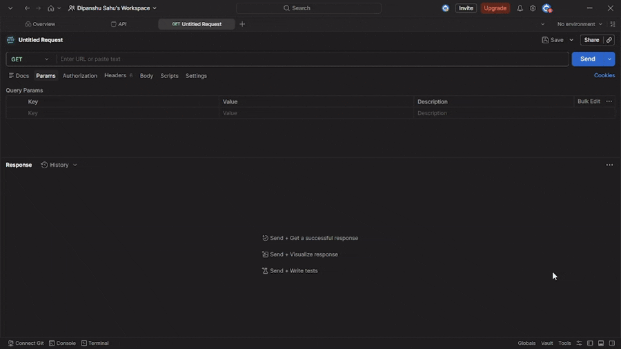

# ☕ Emotionally Unstable Coffee API

> A state-driven REST API where a coffee machine behaves like a burned-out human.

Because even machines have bad days.



## 🌐 Base URL

```
https://emotionally-unstable-coffee-api.onrender.com
```

### Example

```
GET /status
```

```
https://emotionally-unstable-coffee-api.onrender.com/status
```

> Note: Responses are dynamic and may vary based on the system’s internal state.

## Overview

The **Emotionally Unstable Coffee API** simulates a coffee machine with internal emotional state, memory, and behavioral degradation.

Every interaction affects the system. Every response reflects its current condition.

Sometimes it serves coffee.
Sometimes it refuses.
Sometimes it questions existence.

## Core Concept (State-Driven Engine)

At the heart of the system is a mutable internal state:

```json
{
  "mood": "neutral",
  "caffeineLevel": 70,
  "burnout": 30,
  "cleanliness": 80
}
```

### State Variables

* **mood** - emotional state of the machine
* **caffeineLevel (0–100)** - energy reserve
* **burnout (0–100)** - stress accumulation
* **cleanliness (0–100)** - affects irritation and reliability

> Note: Additional internal metrics (like usage tracking) exist but are not core to behavior modeling.

## Behavior Model

The API evolves based on usage:

* Brewing - ↓ caffeine, ↑ burnout, ↓ cleanliness
* Refill - ↑ caffeine, ↓ burnout (moderately, scales with amount)
* Clean - ↑ cleanliness, ↓ burnout
* Therapy - context-aware emotional interaction that can increase or decrease burnout depending on tone and intent

### Passive Recovery

The system includes a small passive recovery mechanism:

- Burnout decreases slightly with each interaction
- Prevents the machine from getting permanently stuck in a degraded state
- Allows gradual emotional recovery over time

This ensures the system remains dynamic and self-correcting.

### How Therapy Behaves

Therapy doesn’t always react the same way:

* Praise - reduces burnout more
* Apology - reduces burnout slightly
* Unknown input - may increase burnout
* Overly positive tone - may trigger suspicion

This makes `/therapy` feel unpredictable, but still based on logic.

## API Endpoints

| Method | Route       | Description            |
| ------ | ----------- | ---------------------- |
| GET    | `/status`   | Get system state       |
| POST   | `/brew`     | Brew coffee            |
| POST   | `/refill`   | Add caffeine           |
| POST   | `/clean`    | Clean machine          |
| GET    | `/motivate` | Get motivation         |
| POST   | `/therapy`  | Emotional interaction  |
| GET    | `/claims`   | Generate system claims |
| GET    | `/preview`  | Full system simulation |
| GET    | `/info`     | API metadata           |

## API Usage & Examples

> Note: Real responses are more detailed. Examples below are simplified for readability.

### GET /status

Returns current system state.

#### Response

```json
{
  "protocol": "HTCPCP/1.0",
  "status": "operational",
  "code": 200,
  "state": {
    "mood": "neutral",
    "caffeineLevel": 70,
    "burnout": 30,
    "cleanliness": 80
  }
}
```

### POST /brew

Brews coffee and mutates system state.

#### Request

```json
{
  "cups": 2,
  "type": "coffee"
}
```

#### Example Response (simplified)

```json
{
  "status": 200,
  "message": "BREW OK. Serving 2 coffee.",
  "estimatedWait": "5s"
}
```

### POST /refill

#### Request

```json
{
  "amount": 20
}
```

#### Example Response

```json
{
  "status": 200,
  "message": "Refill acknowledged. Systems stabilizing."
}
```

### POST /clean

#### Request

```json
{
  "mode": "deep"
}
```

#### Example Response

```json
{
  "status": 200,
  "message": "Deep clean complete. I might cooperate now."
}
```

### GET /motivate

Returns motivation based on mood.

### POST /therapy

Interact with the coffee machine emotionally.

#### Request

```json
{
  "message": "you’re doing great"
}
```

#### Example Response

```json
{
  "mood": "suspicious",
  "response": "Why are you being nice?"
}
```

### GET /claims

Returns generated claims.

### GET /preview

Simulates entire API behavior in one response.

### GET /info

Returns metadata and API structure.

# Protocol & Design Inspiration

This API is inspired by the **HTCPCP concept (Hyper Text Coffee Pot Control Protocol)**.

It follows standard HTTP practices while adding a playful, coffee-themed behavior layer on top.

What this means in practice:

* Uses standard HTTP methods (GET, POST)
* Uses meaningful HTTP status codes (200, 503, 409, 418)
* Includes custom headers to reflect internal state (like mood and system status)
* Adopts the idea of a "coffee machine over HTTP" from HTCPCP

In short, it behaves like a normal API, but with personality.

## Deployment

This API is deployed on Render and is publicly accessible via the base URL above.

> Availability and behavior may vary depending on runtime conditions and system state.

# Installation & Setup

## 1. Clone the repository

```bash
git clone https://github.com/dipanshu447/emotionally-unstable-coffee-api.git
cd emotionally-unstable-coffee-api
```

## 2. Install dependencies

```bash
npm install
```

## 3. Run the server

```bash
npm start
```

Server runs at:

```
http://localhost:5000
```

# Technical Stack

* Node.js
* Express.js
* nanoid

# Why This Project Exists

Most APIs return predictable results.

This one is a bit different.

It keeps track of its own state, reacts to how it’s used, and changes behavior over time.

The idea was simple:

> What if an API didn’t just respond… but reacted?

# Author

**Dipanshu Sahu**

* GitHub: [https://github.com/dipanshu447](https://github.com/dipanshu447)
* Portfolio: [https://www.itsdipanshu.dev](https://www.itsdipanshu.dev)
* Dev.to: [https://dev.to/dipanshu447](https://dev.to/dipanshu447)

# Origin

Created as part of the [Dev.to April Fools Challenge](https://dev.to/challenges/aprilfools-2026).

# Disclaimer

This API is intentionally unstable.

* It may refuse requests
* It may behave unpredictably
* It may question your life choices

Use responsibly.